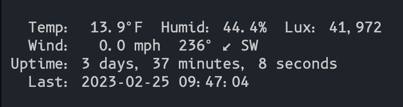

# weatherflow-deno

Weatherflow Tempest UDP listener logger / TUI in Deno.

## Tasks

- `dev`: Run the app
- `gui`: Run the TUI
- `compile`: compile to binary
- `compile-gui`: compile TUI to binary

## Sample Output

```
{
  serial_number: "ST-00055227",
  type: "device_status",
  hub_sn: "HB-00069665",
  timestamp: 1677182716,
  uptime: 34053261,
  voltage: 2.8,
  firmware_revision: 165,
  rssi: -75,
  hub_rssi: -70,
  sensor_status: 655364,
  debug: 0
}
{
  serial_number: "ST-00055227",
  type: "rapid_wind",
  hub_sn: "HB-00069665",
  ob: [ 1677182716, 0.61, 306 ]
}
{
  serial_number: "ST-00055227",
  type: "obs_st",
  hub_sn: "HB-00069665",
  obs: [
    [
      1677182716,     0,  0.13,
            0.89,   308,     3,
         1012.51, -6.01, 81.98,
            6983,  0.08,    58,
               0,     0,     0,
               0,   2.8,     1
    ]
  ],
  firmware_revision: 165
}
```

